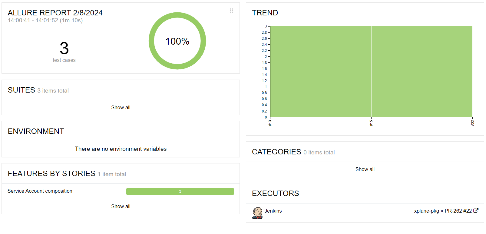
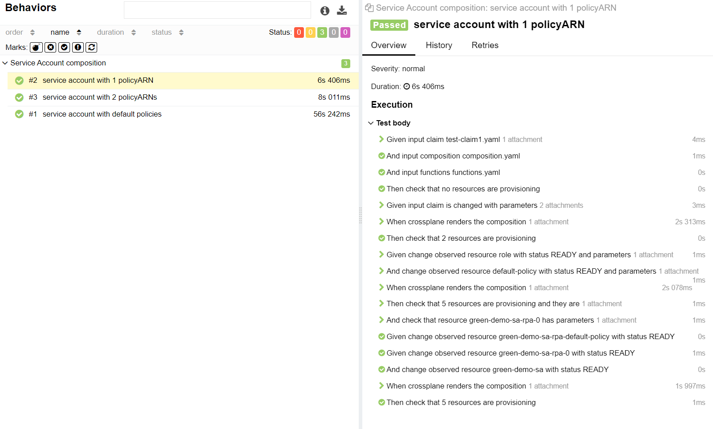

# Crossplane Compostition Tester
Test your crossplane compositions using BDD (Behavior Driven Development). 
If you're not familiar with BDD, check out [this](https://cucumber.io/docs/bdd/). 

[Cucumber](https://cucumber.io/docs/guides/overview/) is a popular BDD framework for testing. It follows the 
[Gherkin](https://cucumber.io/docs/gherkin/) syntax for writing tests (Given, When, Then).
To run the tests, we use [behave](https://behave.readthedocs.io/en/stable/) which 
is a python implementation of Cucumber. We also use Python to implement the steps of the tests.


## Installation
You need to have the [**Crossplane CLI**](https://docs.crossplane.io/latest/cli/) and [**behave**](https://behave.readthedocs.io/en/latest/) installed. You will also need to install
the other dependencies in `requirements.txt` for the python steps implementation of the features.
```bash
# Install the python dependencies 
pip install -r requirements.txt

# Install the latest version of crossplane cli
curl -sL "https://raw.githubusercontent.com/crossplane/crossplane/master/install.sh" | sh
```

You also need to have **Docker running** since the tests are run inside a docker container.


## Quick start 
In order to get started, we set up an [example composition for a service account](test/pkg/service-account-with-functions/composition.yaml) inside the `test` folder.

The composition will create the following resources:
- a `Role`
- a default `Policy`
- Any custom policies or predefined policies ARNs provided in the claim
- a `RolePolicyAttachment` for each policy **once the role and the policies are ready** 
- a `ServiceAccount` object **once the role is ready**

Now you can explore the [feature file](test/composition-tests/service-account-with-functions/service-account.feature) we've written to get an idea
of how to write features and test different use cases.

You can run the tests with the following command:
```bash
behave test
```

You can check out what options are available for the `behave` command by running
```bash
behave --help
```
Some useful options include `--tags` or `-t` to run only scenarios with a certain tag. Some tags related to the severity 
of the scenario or the feature (like "minor" or "critical") are specific to test reporting tools like [allure](https://github.com/allure-framework/allure-python/blob/master/allure-behave/examples/severity.rst).

**Note**: IDEs like Pycharm have a built-in support for behave and other BDD frameworks will allow you to run the tests directly from the IDE.

You can also use our custom `tests_runner.sh` script, that runs the tests against a target folder with feature files and generates cucumber and allure reports that you can view in your CI tool.
```bash
./tests_runner.sh test/composition-tests
```
Here is an example output with the Jenkins allure plugin






## Motivation
Crossplane compositions files can become complex and in turn very error-prone.
So far, there hasn't been a clear or easy way to test your crossplane compositions in a quick and reproducible way
other than to test them live in a cluster. This is not ideal for a few reasons:
- It can be a very slow process depending on the composition
- It's not easy to debug
- It does not allow you to test with different combination of inputs (i.e. different configurations).

This tool aims to solve this problem by allowing you to test your compositions locally and quickly, as well as define tests
in a way that is easy to read and reason about. This tool relies on two main components:
- [behave](https://behave.readthedocs.io/en/stable/) - A python implementation of Cucumber, that allows you to define your tests in plain english
in a BDD (Given, When, Then) format. 
- Crossplane [composition functions](https://docs.crossplane.io/latest/concepts/composition-functions/).

The Crossplane v1.14 release introduced a new major feature, [composition functions](https://docs.crossplane.io/latest/concepts/composition-functions/).
Composition functions allow you to define your composition programmatically using a language of your choice (python, go, etc). 
It came accompanied by the very convenient [render command in the crossplane CLI](https://docs.crossplane.io/latest/concepts/composition-functions/#test-a-composition-that-uses-functions).
Given a composition that uses composition functions, this command allows you to render it locally without having to spin up a kubernetes cluster and
see the output that will be passed to the providers if you were to run it inside a cluster.

Combining both the power of the crossplane `render` command and the BDD approach, we now have a very powerful and expressive way
to test our compositions. In the end, whether you write your compositions in yaml or as code with the new composition functions feature,
this tool can become very valuable in validating your compositions with different use cases.

## Features
Check [the features README in the docs](docs/features.md) to get an overview of how to write features and the rationale behind them in the context of testing Crossplane compositions.

## How it works
Check [how this tool works](docs/how_it_works.md).

## CI/CD Integration
`Behave` has very good integration with test-reporting tools like [Allure](https://allurereport.org/). 

For example in Jenkins, you can install the [Allure plugin](https://plugins.jenkins.io/allure-jenkins-plugin/), and
then run the `tests_runner.sh` script which will run the tests with `behave` and generate allure-reports that can 
then be viewed in Jenkins as seen in the [Quickstart](##quick-start).

## Features Reference

This is an overview of all the features that are currently supported. More can be added later.

### Given (Arrange)

| Step                                                                                                                                                                                                                                                      | Description                                                                                                                                                                                                                                                                                     |
|-----------------------------------------------------------------------------------------------------------------------------------------------------------------------------------------------------------------------------------------------------------|-------------------------------------------------------------------------------------------------------------------------------------------------------------------------------------------------------------------------------------------------------------------------------------------------|
| `Given input claim <CLAIM>`                                                                                                                                                                                                                               | Provide the name of the claim file to be used in the test. By default, the claim file should be named `claim.yaml`. Claims should be stored inside the `resources` subfolder inside each feature folder.                                                                                        |
| `Given input composition <COMPOSITION>`                                                                                                                                                                                                                   | Provide the name of the composition file. By default, the composition should be named `composition.yaml`. Compositions should be stored inside the `pkg/<RESOURCE>` directory of the project. This step is OPTIONAL.                                                                            |
| `Given input functions <FUNCTIONS>`                                                                                                                                                                                                                       | Provide the name of the functions file. By default, the functions file should be named `functions.yaml`. Functions should be stored inside at the root of the test directory containing the feature files of the project (e.g. `test/composition-tests/functions.yaml`). This step is OPTIONAL. |
| <pre><code>Given input claim is changed with parameters </code><br><code>\| param name \| param value \| </code><br><code>\| param-1 \| value-1 \|</code><br><code>\| param-2 \| value-2 \| </code></pre>                                                 | Updates the claim with the parameters provided in the data table.                                                                                                                                                                                                                               |
| `Given change all observed resources with status <READY_STATUS>`                                                                                                                                                                                          | Sets the ready status of all resources in the current observed state                                                                                                                                                                                                                            |
| <pre><code>Given change following observed resources with status <READY_STATUS></code><br><code>\| resource-name \|</code><br><code>\| resource-1 \|</code><br><code>\| resource-2 \|</code></pre>                                                        | Sets the ready status of the given resources in the current observed state                                                                                                                                                                                                                      |
| `Given change observed resource <RESOURCE_NAME> with status <READY_STATUS>`                                                                                                                                                                               | Sets the ready status of the given resource in the current observed state                                                                                                                                                                                                                       |
| <pre><code><br/>Given change observed resource <RESOURCE_NAME> with parameters</code><br><code>\| param name \| param value \| </code><br><code>\| param-1 \| value-1 \|</code><br><code>\| param-2 \| value-2 \| </code></pre>                           | Update or set the parameters of the given resource in the current observed state                                                                                                                                                                                                                |
| <pre><code><br/>Given change observed resource <RESOURCE_NAME> with status <READY_STATUS> and parameters</code><br><code>\| param name \| param value \| </code><br><code>\| param-1 \| value-1 \|</code><br><code>\| param-2 \| value-2 \| </code></pre> | Sets the ready status of the given resource in the current observed state and update its parameters                                                                                                                                                                                             |


### When (Act)

Currently, the only supported action is `crossplane renders the composition` which will run the crossplane `render` command with the given inputs from your feature file.

| Step                                      | Description                                                |
|-------------------------------------------|------------------------------------------------------------|
| `When crossplane renders the composition` | We apply the claim with the current observed state, if any |

### Then (Assert)

| Step                                                                                                                                                                                                                | Description                                                                                                                                                 |
|---------------------------------------------------------------------------------------------------------------------------------------------------------------------------------------------------------------------|-------------------------------------------------------------------------------------------------------------------------------------------------------------|
| `Then check that <NUMBER> resources are provisioning`                                                                                                                                                               | Check that a number of resources are being provisioned after we apply a claim.                                                                              |
| <pre><code>Then check that <NUMBER> resources are provisioning and they are</code><br><code>\| resource-name \|</code><br><code>\| resource-1 \|</code><br><code>\| resource-2 \|</code></pre>                      | Check that a number of resources are being provisioned after we apply a claim and check that their names is equal to the ones you provide in the data table |
| <pre><code>Then check that resource <RESOURCE_NAME> has parameters</code><br><code>\| param name \| param value \| </code><br><code>\| param-1 \| value-1 \|</code><br><code>\| param-2 \| value-2 \| </code></pre> | Check that a provisioned resource has the parameters you provide in the data table.                                                                         |
| `Then check that no resources are provisioning`                                                                                                                                                                     | Check that no resources are being provisioned                                                                                                               |

## Built With
- [Crossplane CLI](https://docs.crossplane.io/latest/cli/): Crossplane CLI tool that includes the `render` command, used extensively in this project (under Apache 2.0 License).
- [behave](https://pypi.org/project/behave/): BDD framework in Python (under BSD license).
- [python-benedict](https://pypi.org/project/python-benedict/): Python library for manipulating dicts including keypath support (under MIT License).
- [allure-behave](https://pypi.org/project/allure-behave/): Allure test reporting for *behave* (under Apache 2.0 License).


## Contributing
Pull requests are welcome. For major changes, please open an issue first to discuss what you would like to change. Check [CONTRIBUTING.md](CONTRIBUTING.md) for more.

## License
This project is licensed under the Apache 2.0 License - see the [LICENSE](LICENSE) file for details
