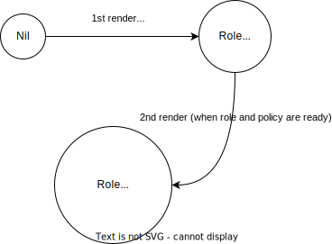

# How it works
This tool puts together a couple of preexisting tools such as [**Crossplane CLI**](https://docs.crossplane.io/latest/cli/) and [**behave**](https://behave.readthedocs.io/en/latest/), for you to define BDD tests for your Crossplane compositions.
Tests defined in *feature files* are run using the `behave` command. By default, `behave` will automatically
detect features files defined in the target folder you give as argument. Check [here](https://behave.readthedocs.io/en/stable/gherkin.html#layout-variations) for more info
on how `behave` detects feature files.

The steps used in the feature files are implemented inside the `steps` folder. This is the **main contribution of this project, where we define steps available for use to test Crossplane compositions**. The `environment.py` helps setup some fixtures for the tests like setting up where the tests should look for 
the input files. 

Under the hood, tests run the crossplane `render` command with the given inputs from your feature file. 
It then compares the rendered output with the expected output. 
In that sense, this tool is a wrapper around the crossplane `render` command.

The [crossplane CLI render command]((https://docs.crossplane.io/latest/concepts/composition-functions/#test-a-composition-that-uses-functions).) accompanied the composition functions feature in the v1.14 Crossplane release. It's used to render locally
your compositions given a claim. The output is what is usually passed on to the providers if the composition ran in a real cluster. It takes in the composition, the claim for that composition and the composition functions as inputs.
```bash
crossplane beta render claim.yaml composition.yaml functions.yaml
```

Some compositions are deterministic and will always render the same output given the same inputs. However, **compositions
are usually non-deterministic and will give different outputs depending on the current observed state**. This reflects
what happens when you run the composition in a real cluster. This can occur for instance when the resources depend on some input from the claim or if there are dependencies between managed resources. For example, 
in the [service account composition](test/pkg/service-account-with-functions/composition.yaml) , a `RolePolicyAttachment` resource object cannot be created until the `Role` and `Policy` resource objects have been created.

To emulate this behavior, the crossplane `render` command also takes an additional optional argument, the **observed state**.
```bash
crossplane beta render claim.yaml composition.yaml functions.yaml -o observed.yaml
```

The observed state is a yaml file that contains the list of resources that are or already have been provisioned.

```yaml
policy:
  apiVersion: iam.aws.crossplane.io/v1beta1
  kind: Policy
  metadata:
    # omitted for brevity
  spec:
    # omitted for brevity
role:
  apiVersion: iam.aws.crossplane.io/v1beta1
  kind: Role
  metadata:
    # omitted for brevity
  spec:
    # omitted for brevity
```

This is also an example of an output of the render command (with the composite resource omitted). We can use that output as observed state for another render command .
**This way, we can emulate the behavior of a real cluster where the resources are created depending on the current state, and test the composition under different configurations.**



Tests inspect the output of the render command and comparing it with the expected output that you've defined in your feature file.